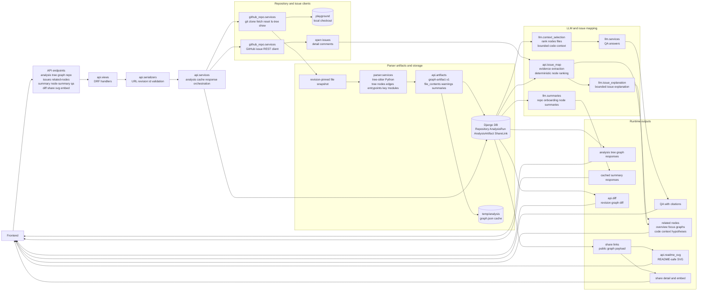
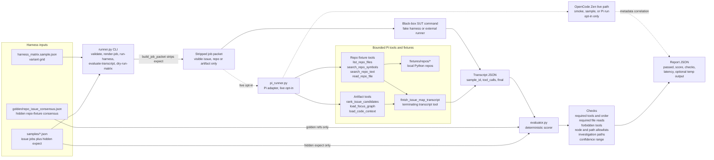

# capstone-26-01 Backend

Backend service for analyzing public GitHub Python repositories and turning them
into graph, tree, issue, summary, and QA payloads for the frontend.

## Backend Runtime Structure



## Evaluation Harness Structure



The core product flow is:

1. A user submits a public GitHub repository URL.
2. The backend shallow-clones or refreshes that repository, pins the analyzed
   commit SHA, and parses Python files into a code graph.
3. The frontend renders the graph/tree and can reuse the returned
   `analysis_id` for summaries, node-focused QA, diffs, shares, and issue
   mapping.
4. The issue workflow reads open GitHub issues, lets the user pick one, then
   ranks the most relevant code nodes and returns a focused graph plus bounded
   code context.

## Current Capabilities

- Repository ingestion for canonical public GitHub URLs such as
  `https://github.com/psf/requests`.
- Python-focused static analysis using tree-sitter.
- File tree, symbol tree, graph nodes, graph edges, entrypoints, and key-module
  ranking.
- Stored analysis artifacts keyed by repository and commit revision.
- Revision-pinned graph diffs.
- Share links, embed payloads, and README-safe SVG graph images.
- LLM-backed repository summaries, onboarding summaries, node summaries, and QA.
- Live GitHub issue listing and issue-to-code related-node ranking.
- Deterministic issue-map evaluation tooling, including optional live Pi/OpenCode
  checks for model/tool comparisons.

## Architecture

```text
api/          DRF views, serializers, response assembly, artifacts, diffs,
              issue-map ranking, share/embed/SVG helpers
github_repo/  GitHub repository cloning, git snapshotting, GitHub issue REST
              calls, issue normalization, repo/file safety checks
parser/       Python tree-sitter parsing, tree/graph construction, static edge
              resolution, entrypoint and key-module scoring
llm/          QA context selection, OpenAI/Gemini calls, optional smolagents QA,
              summaries, bounded issue explanations
harness_eval/ Deterministic issue-map runner evaluation suite and optional live
              Pi/OpenCode adapters
config/       Django settings, OpenAPI/Swagger routing, WSGI/ASGI entrypoints
```

Runtime scratch files are expected under `temp/`. Cloned external repositories
live under `playground/`.

## Main Runtime Flow

### Repository Analysis

`/api/analysis/`, `/api/tree/`, `/api/graph/`, `/api/qa/`, share endpoints, and
diff endpoints all build on the same analysis pipeline:

1. `api.serializers` validates the incoming GitHub URL and optional revision.
2. `github_repo.services` shells out to `git` to clone, fetch, reset, list files,
   resolve revisions, and read file contents.
3. `api.services` reads only `.py` file contents, enforces configured limits, and
   calls `parser.services.parse_repo`.
4. `parser.services` builds a tree and graph with directory, file, module, class,
   function, method, and external nodes.
5. `api.artifacts` normalizes the parser output into `graph-artifact.v1` and
   stores it in the database as an `AnalysisArtifact`.

The stored artifact includes:

- `repo`, `revision`, `ref`, `generated_at`, `status`, and analysis limits.
- `tree`, `nodes`, `edges`, `entrypoints`, `key_modules`, and `warnings`.
- Python `file_contents`, used by QA, summaries, and issue code context.
- Cached generated summaries.

### Graph Semantics

Node IDs are stable enough for frontend reuse within a pinned revision:

- File: `pkg/app.py`
- Module: `module::pkg.app`
- Class: `pkg/app.py::ClassName`
- Function: `pkg/app.py::function_name`
- Method: `pkg/app.py::ClassName::method_name`

Edges include `contains`, `imports`, `inherits`, `calls`, and synthetic
`entrypoint` relationships. Edge resolution is static and heuristic: it handles
common imports, aliases, same-file calls, and `self.method()` calls, but it is
not a type-aware Python interpreter.

### Issue-To-Code Workflow

The current issue pivot is implemented without changing the existing graph and
tree endpoints:

1. `GET /api/issues/?url=...` returns open GitHub issues. Pull requests are
   filtered out. `mock=true` returns mock issue data for frontend/test work.
2. The frontend keeps the graph view and lets the user select an issue.
3. `POST /api/issues/related-nodes/` receives `analysis_id` and `issue_number`.
4. The backend fetches issue detail and comments, extracts deterministic evidence
   from titles, bodies, labels, stack traces, symbols, and file mentions.
5. `api.issue_map` ranks relevant graph nodes, returns highlighted node IDs,
   overview/focus graph projections, hypotheses, investigation path, bounded
   code excerpts, confidence, and warnings.
6. Optional bounded LLM explanation can enrich the deterministic result. Ranking
   remains deterministic backend logic.

Pi/OpenCode is evaluation tooling in this repo, not the default runtime issue
mapper.

## API Surface

Swagger is available at `/api/docs/`; the OpenAPI schema is at `/api/schema/`.

| Endpoint | Method | Purpose |
| --- | --- | --- |
| `/api/analysis/` | `GET`, `POST` | Analyze a repository and return the full artifact. |
| `/api/analysis/<analysis_id>/` | `GET` | Retrieve a stored analysis run. |
| `/api/tree/` | `GET` | Return the parsed tree for a repository/revision. |
| `/api/graph/` | `GET` | Return graph nodes, edges, entrypoints, and key modules. |
| `/api/repo/` | `GET` | Return a raw repository file path list. |
| `/api/qa/` | `POST` | Answer a question using selected graph/code context. |
| `/api/summary/` | `GET` | Generate or return a cached repo/onboarding summary. |
| `/api/node-summary/` | `GET` | Generate or return a cached node summary. |
| `/api/issues/` | `GET` | List open GitHub issues for a repository. |
| `/api/issues/related-nodes/` | `POST` | Map a selected issue to relevant graph nodes and code context. |
| `/api/diff/` | `GET` | Diff two revisions for the same repository. |
| `/api/analysis/<analysis_id>/diff/` | `GET` | Diff two stored analysis IDs. |
| `/api/share/` | `POST` | Create a public share link for an analysis. |
| `/api/share/<share_id>/` | `GET` | Retrieve public share data. |
| `/api/share/<share_id>/graph.svg` | `GET`, `HEAD` | Render a README-safe SVG for a share. |
| `/api/readme-graph.svg` | `GET`, `HEAD` | Render a README-safe SVG directly from a repo URL. |
| `/api/embed/<share_id>/` | `GET` | Return an iframe-friendly HTML embed page. |

## Local Setup

```bash
python -m venv venv
source venv/bin/activate
pip install -r requirements.txt
python manage.py migrate
python manage.py runserver
```

## Testing

Application tests:

```bash
python manage.py test api llm
```

Issue-map harness and sample validation:

```bash
python -m unittest harness_eval.tests
python -m harness_eval.runner validate-samples
python -m harness_eval.runner validate-matrix
python -m harness_eval.runner validate-golden
```

Optional live OpenCode/Pi checks are opt-in only. Offline tests must not perform
live provider calls.

## Evaluation Suite

`harness_eval/` is a deterministic test harness for issue-map runners. It checks
whether a model/tool/MCP/skill configuration actually solves repository issue
localization tasks instead of merely producing plausible text.

The suite contains:

- Synthetic and repo-fixture samples under `harness_eval/samples/`.
- Hidden expected outputs and judge-consensus data under `harness_eval/golden/`.
- A deterministic evaluator that checks required tool use, forbidden tool use,
  required file reads, node/path allowlists, investigation-path paths, and
  confidence bounds.
- A Pi runner adapter using bounded tools from `harness_eval/pi/`.
- Optional OpenCode Zen live smoke/sample commands for dashboard and provider
  correlation.

The system under test never receives hidden `expect` fields.

## Important Caveats

- Only public GitHub repositories are supported in normal operation.
- Accepted repository URLs are canonical `https://github.com/<owner>/<repo>`
  URLs. Branch/tree/blob URLs and `.git` suffix URLs are rejected.
- Revision validation is intentionally conservative and currently rejects branch
  names with slashes.
- Git must be available on the server; repository ingestion uses shell `git`.
- Non-Python files appear as tree/graph file nodes, but only `.py` files are
  parsed into symbols and code context.
- First analysis of a repository can be slow. Later calls reuse the stored
  artifact for the same commit revision.
- Static graph edges are heuristic and can miss dynamic dispatch, complex imports,
  wildcard imports, nested definitions, or ambiguous duplicate symbol names.
- `/api/analysis/` artifacts include Python file contents. Public share graph
  payloads omit file contents.
- LLM calls require configured provider keys unless the selected workflow has no
  usable code context.

## Development Notes

- Keep view logic thin and put business logic in service modules.
- Do not call GitHub APIs outside `github_repo/services.py`.
- Preserve existing `tree`, `nodes`, and `edges` response keys unless the
  frontend impact is traced.
- Use task branches from `dev`; land completed work back into `dev`, not `main`.
- Keep temporary runtime output under `temp/` and external repositories under
  `playground/`.
